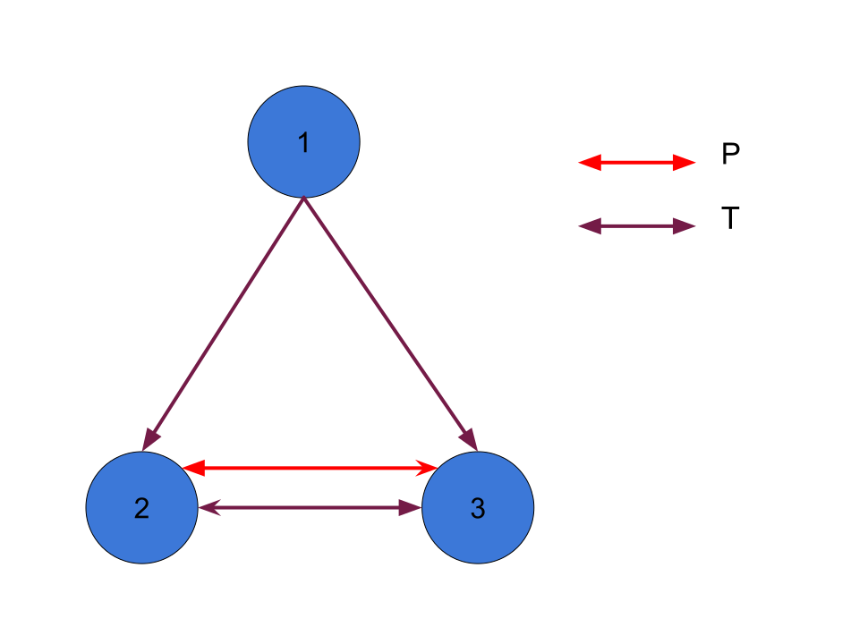

 
 

# Ejercicio 1
# Ejercicio 2*
a. Sabemos que $\Delta \vdash \varphi$ (pertenece al conjunto).  
Si $\varphi$ no es universalmente válida, entonces existe un modelo $\mathcal{M}$ tq $\mathcal{M} \not\models \varphi$.  
 Entonces no es correcto con respecto a la clase de todos los modelos. 

b. el conjunto de todos los modelos $\vdash SQ_1$. Pero $\Delta \not\vdash SQ_1$. Entonces $\Delta$ no es completo con respecto al conj de todas las interpretaciones.  

c. 
- CORRECTO: Sabemos que $\Delta \vdash \varphi$ (pertenece al conjunto).  
Si $\varphi$ es universalmente válida, entonces todo modelo $\mathcal{M}$ pasa que $\mathcal{M} \models \varphi$. Entonces es correcto con respecto a la clase de todos los modelos. 
- COMPLETO: el conjunto de todos los modelos $\vdash SQ_i$. También $\Delta \vdash SQ_i$ (porque pertenece). Entonces $\Delta$ es completo con respecto al conj de todas las interpretaciones. 
# Ejercicio 3
# Ejercicio 4
# Ejercicio 5*
a. 
SQ8 es válido porque $P \contenido T$.  
SQ9 es válido porque $P \contenido T$ y $T$ es transitiva.  
SQ9 es válido porque $T$ es la relación transitiva extendida de $P$.

b. 
$$\varphi: \forall xy(T(x,y) \implica \exist z(P(x,z)))$$
La $\varphi$ nos dice: "Si hay una relación transitiva entre x e y, entonces existe una relación entre x y z"

Tomamos el modelo:  

Cumple SQ8, SQ9, SQ10 pero no cumple $\varphi$.

c. No es completa porque encontramos un modelo que en el que no vale $\varphi$, entonces no es posible que $SQ^+ \vdash \varphi$.

# Ejercicio 6*
Veamos que nos dicen los tres axiomas nuevos:
- $\forall x(0 \neq x+1)$ Es decir, x aplicada con 1 nunca nos da 0.
- $\forall xy(x+1 = y+1 \implica x = y)$ Es inyectiva (al aplicarle 1).
- $\forall xy((x+y)+1=x+(y+1))$ Es asociativa (no tan fuerte enrealidad).

Entonces tenemos que buscar una función binaria total que sea inyectiva, asociativa y que al aplicarla al 1 no nos de 0.

Podemos observar que no nos fuerza la propiedad conmutativa.  
<imp>TERMINAR</imp>

P1 vale, P2 no vale
# Ejercicio 7
# Ejercicio 8*
# Ejercicio 9
# Ejercicio 10*
La fórmula sería:
$$\exist n (f^n(e) = e)$$
# Ejercicio 11*
# Ejercicio 12