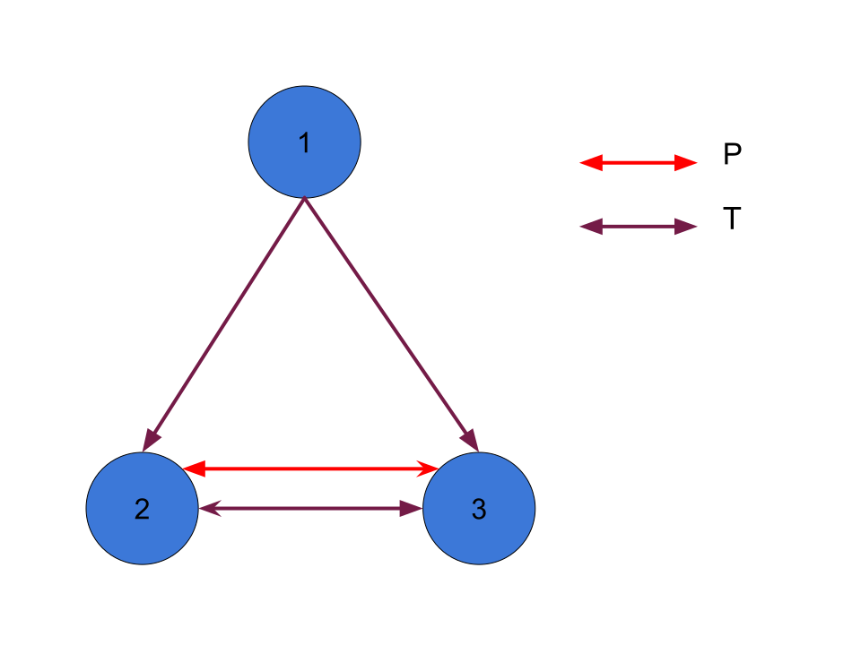

---
title: Guía 7 - Sistemas deductivos, completitud y compacidad para lógica de primer orden
date: Verano 2021
author: Solución de un alumno
header-includes: |
    \usepackage{../../Util/macros}
geometry: margin=3cm
...

# Ejercicio 1
# Ejercicio 2*
a. Sabemos que $\Delta \vdash \varphi$ (pertenece al conjunto).  
Si $\varphi$ no es universalmente válida, entonces existe un modelo $\mathcal{M}$ tq $\mathcal{M} \not\models \varphi$.  
 Entonces no es correcto con respecto a la clase de todos los modelos. 

b. el conjunto de todos los modelos $\vdash SQ_1$. Pero $\Delta \not\vdash SQ_1$. Entonces $\Delta$ no es completo con respecto al conj de todas las interpretaciones.  

c. 
- CORRECTO: Sabemos que $\Delta \vdash \varphi$ (pertenece al conjunto).  
Si $\varphi$ es universalmente válida, entonces todo modelo $\mathcal{M}$ pasa que $\mathcal{M} \models \varphi$. Entonces es correcto con respecto a la clase de todos los modelos. 
- COMPLETO: el conjunto de todos los modelos $\vdash SQ_i$. También $\Delta \vdash SQ_i$ (porque pertenece). Entonces $\Delta$ es completo con respecto al conj de todas las interpretaciones. 
  
# Ejercicio 3
SQ8: $\forall xyz(R(x,y) \y R(y,z) \implica R(x,z))$  

$SQ^T = SQ \union \llaves{SQ8}$

a. Si 
$$\m{C} = \llaves{\m{A}:\m{A} \text{ es un modelo transitivo}}$$ 
Sea
$$\m{C}' = \llaves{\m{A}:\m{A}\models SQ^T}$$ 
Basta con ver que:
$$\m{C} = \m{C}'$$ 

Para demostrar que $SQ^T$ es correcto y completo con respecto a $\m{C}$.  
$(\contenido)$ Si $\m{M}$ es un modelo transitivo entonces $\m{M} \models SQ8$.

$(\supseteq)$ Si $\m{M} \models SQ8$ implica que la relación binaria que tiene el modelo es transitiva. 

Entonces estamos bajo el teorema de Godel, entonces $SQ^T$ es correcto y completo con respecto a $\m{C}$.  
\
b. Qvq para toda fórmula $\varphi$: 
$$\m{C} = \llaves{\text{todos los modelos}}$$  
$$\m{C} \models \varphi \entonces SQ^T \vdash \varphi$$  
Vemos que:
$$\m{C} \models \varphi \entonces SQ \vdash \varphi \underset{(*)}{\entonces} SQ \union \llaves{SQ8} \vdash \varphi$$
$$\entonces SQ^T \vdash \varphi$$
(*) vale porque $SQ \union \llaves{SQ8}$ es consistente.  
\
c. Ya visto en (a).  
\
d. Qvq NO es cierto que para toda fórmula $\varphi$:
$$\m{C} = \llaves{\text{todos los modelos}}$$ 
$$SQ^T \vdash \varphi \entonces \m{C} \models \varphi$$

Entonces buscamos $\varphi$ tq:
$$SQ^T \vdash \varphi \y \m{C} \not\models \varphi$$
Sea el modelo $\m{M} = (\N,=)$, es decir la funcío binaria es la igualdad con interpretación estandar. Vemos que si tomamos $\varphi$ como $SQ8$:
$$SQ^T \vdash \varphi \y \m{M} \not\models \varphi \entonces \m{C} \not\models \varphi$$

# Ejercicio 4
# Ejercicio 5*
a. 
SQ8 es válido porque $P \contenido T$.  
SQ9 es válido porque $P \contenido T$ y $T$ es transitiva.  
SQ9 es válido porque $T$ es la relación transitiva extendida de $P$.

b. 
$$\varphi: \forall xy(T(x,y) \implica \exist z(P(x,z)))$$
La $\varphi$ nos dice: "Si hay una relación transitiva entre x e y, entonces existe una relación entre x y z"

Tomamos el modelo:  

Cumple SQ8, SQ9, SQ10 pero no cumple $\varphi$.

c. No es completa porque encontramos un modelo que en el que no vale $\varphi$, entonces no es posible que $SQ^+ \vdash \varphi$.

# Ejercicio 6*
Veamos que nos dicen los tres axiomas nuevos:
- $\forall x(0 \neq x+1)$ Es decir, x aplicada con 1 nunca nos da 0.
- $\forall xy(x+1 = y+1 \implica x = y)$ Es inyectiva (al aplicarle 1).
- $\forall xy((x+y)+1=x+(y+1))$ Es asociativa (no tan fuerte enrealidad).

Tomamos el modelo $\m{M} = (\N, +, 0_{\m{M}}, 1_{\m{M}})$.  
Donde $0_{\m{M}}: 1$ y $1_{\m{M}}: 2$. Este modelo cumple con los axiomas.

Sea la siguiente fórmula:
$$\varphi: \forall x(0+x=x)$$

Sucede que:
$$\mathcal{C} \models \varphi$$
$$\mathcal{M} \models P$$
Pero
$$\mathcal{M} \not\models \varphi \entonces P \not\vdash \varphi$$

# Ejercicio 7
a.  
$$\varphi_2: \exist xy(x \neq y)$$
$$\varphi_3: \exist xyz(x \neq y \y x \neq z \y y \neq z)$$
$$...$$
$$\varphi_n: \exist z_1...z_n(z_1 \neq z_2 \y ... \y z_1 \neq z_n \y z_2 \neq z_3 \y ... \y z_{n-1} \neq z_{n})$$

$\Gamma = \llaves{\varphi_i:i \in \N}$

$\m{M} \models \Gamma$ entonces $M$ es infinito.  

Nota: $(\times_1 \neq \times_2) \equiv \neg(\times_1 = \times_2)$  
\
b. Asumimos que existe tal fórmula y la llamamos $\a$.
Sea $\Gamma' = \Gamma \union \llaves{\a}$.

- Veamos que es insatisfacible: Suponemos que es satisfacible, entonces existe un modelo y una valuación tal que $\m{M},v \models \Gamma'$. Entonces $\m{M},v \models \Gamma$ entonces el dominio es infinito. Pero también $\m{M},v \models \a$ que significa que el dominio es finito. Absurdo. Entonces el conjunto $\Gamma'$ es insatisfacible.

- Veamos que es satisfacible: para cualquier subconjunto finito $\Delta \contenido \Gamma'$ puede pasar que no contenga ningún $\varphi_i$ entonces simplemente tomando el modelo con un elemento en el dominio lo satisface. Si por el otro lado contiene $\varphi_i$, tomamos $k$ como el mayor $i$ tq $\varphi \in \Delta$. Entonces tomamos el modelo que tiene $k+1$ elementos en el dominio y este va a satisfacer a $\Delta$. Entonces por compacidad, como todo subconjunto es satisfacible entonces el conjunto $\Gamma'$ es satisfacible.

Absurdo, no puede ser satisfacible y no satisfacible. Entonces no es expresable la fórmula $\a$.
# Ejercicio 8*
Suponemos que es expresable. Entonces:
$$\varphi_{s}(x,y):\text{pertenece a la clausura transitiva de la relación binaria }R^\mathcal{M}$$

Definimos las siguiente fórmulas:
$$\varphi_0(x,y): \neg\exist z(R(x,z) \y R(z,y) \implica R(x,y))$$
$$...$$
$$\varphi_i(x,y) : \neg\exist z_1z_2...z_i(R(x,z_1) \y$$ 
$$R(z_1,z_2) \y ... \y R(z_{n-1},z_n) \y R(z_n,y) \implica R(x,y))$$

Definimos:
$$\Phi = \llaves{\varphi_i : i \in \N}$$
$$\Gamma = \Phi \union \llaves{\varphi_s}$$

Veamos que sea satisfacible:
$$\mathcal{M} \models \Phi \entonces R \text{ no es transitiva}$$
$$\mathcal{M} \models \varphi_s \entonces R \text{ es transitiva}$$
Si $\mathcal{M} \models \Gamma$, entonces $R$ es transitiva y no es transitiva. Absurdo.

Veamos que es satisfacible:   
Sea $\Delta$ un conjunto finito tq $\Delta \subset \Gamma$, veamos que es satisfacible.
- $\Delta = \llaves{\varphi_s}$ ó $\Delta = \vacio$
- En otro caso:
Tomamos $k$ como el máximo $i$ tq $\varphi_i \in \Delta$. Entonces vamos a armar un modelo que satisfaga $\Delta$.  
Tomamos el modelo $\mathcal{M}$ tq $R_{\mathcal{M}} = \llaves{(1,2),(2,3),...,(k,k+1),(1,k+1)}$. Entonces $\mathcal{M} \models \Delta$.

Entonces es satisfacible. Absurdo. Entonces no existe una fórmula para para $\varphi_s$.

# Ejercicio 9
Suponemos que es expresable la propiedad y la llamamos $\a$ a tal fórmula.
$$\varphi_i: \text{"existen dos nodos que no están conectados por i o menos pasos"}$$
$$\varphi_0: \neg\forall xy(R(x,y))$$
$$\varphi_1: \exist xy(\exist z(R(x,z) \y R(z,y)) \y R(x,y) \y distintos(x,y,z))$$
$$...$$
$$\varphi_n: \neg\forall xy(\exist z_1,...,z_n(R(z_1,z_2) \y R(z_2,z_3) \y ... \y R(z_{n-1},z_n))$$

$\Phi = \llaves{\varphi_i:i\in\N}$  
$\Gamma = \Phi \union \llaves{\a}$

- Veamos que es insatisfacible: Suponemos que es satisfacible, entonces existe un modelo y una valuación tal que $\m{M},v \models \Gamma$. Entonces $\m{M},v \models \Phi$ entonces existe un par de nodos que no tiene camino finito. Pero también $\m{M},v \models \a$ que significa que para todo par de nodos hay un camino finito. Absurdo. Entonces el conjunto $\Gamma$ es insatisfacible.

- Veamos que es satisfacible: para cualquier subconjunto finito $\Delta \contenido \Gamma'$ puede pasar que no contenga ningún $\varphi_i$ entonces simplemente tomando el modelo con un elemento en el dominio lo satisface. Si por el otro lado contiene $\varphi_i$, tomamos $k$ como el mayor $i$ tq $\varphi \in \Delta$. Entonces tomamos el modelo que tiene $k+1$ elementos en el dominio y este va a satisfacer a $\Delta$. Entonces por compacidad, como todo subconjunto es satisfacible entonces el conjunto $\Gamma'$ es satisfacible.

Absurdo, no puede ser satisfacible y no satisfacible. Entonces no es expresable la fórmula $\a$.

# Ejercicio 10*
Suponemos que es expresable. Entonces:
$$\a:\text{f es una función circular}$$

Definimos las siguiente fórmulas:
$$\varphi_0: \exist x(f(x) \neq x)$$
$$\varphi_1: \exist x(f^2(x) \neq x)$$
$$...$$
$$\varphi_i: \exist x(f^i(x) \neq x)$$

$\Phi:\llaves{\varphi_i:i\in\N}$  
$\Gamma:\Phi \union \llaves{\a}$

I) Suponemos que $\Gamma$ es satisfacible. Entonces existe $\mathcal{M}$ y $v$ valuación tq $\mathcal{M},v \models \Gamma$. De aquí se desprende que $\mathcal{M},v \models \Phi$, lo cual implica que f no es circular porque no existe $i \in \N$ tq $\forall x(f^i(x) = x)$. Pero también $\mathcal{M},v \models \a$. Lo cual implica que f es circular. Absurdo. Entonces $\Gamma$ es insatisfacible.

II) Sea $\Delta \contenido \Gamma$, $\Delta$ finito. Entonces es de la forma:
- No tiene ningún $\varphi_i$: $\Delta = \llaves{\a}$ ó $\vacio$
- Tiene algún $\varphi_i$: Tomamos $k$ como el mayor natural $i$ tq $\varphi_i \in \Delta$. Entonces tomamos el modelo $\mathcal{M}$ tq tiene una $f_{\mathcal{M}}$ que cumple que es circular a partir de $k+1$ iteraciones. Entonces el modelo satisface $\Delta$.

Entonces por compacidad $\Gamma$ es satisfacible. Absurdo, no puede ser satisfacible y no satisfacible. Entonces $\a$ no es expresable.

# Ejercicio 11*

# Ejercicio 12
a. $S1$: Sabemos por los naturales que el sucesor de un número natural nunca va a ser 0.  
$S4_n$: Sabemos que los naturales tienen la propiedad que siempre existe un sucesor (y es distinto del anterior). Entonces $S4_n$ es siempre verdadera.  
b. $\Gamma$ finito,
$$Con(\Gamma) = Con(\Sigma)$$  
- $\Sigma$ insatisfacible: por compacidad existe subconjunto de $\Sigma$ insatisfacible. Listo.
- $\Sigma$ satisfacible: Sabemos que $\Gamma \contenido Con(\Sigma)$ (por def de $Con$).  
Sea $\Delta \contenido \Sigma$ tq $\Delta \models \Gamma$ y que sea el mínimo que se pueda formar. Entonces vemos que es finito porque $\Gamma$ es finito (solo se necesitan finitos elementos para derivar finitos elementos).  
Notemos que $\Delta \models \Gamma$, entonces $\Delta \models \Sigma$. Listo.

c. Sea $k$ el mayor $i$ tq $S4_i \in \Gamma$, entonces podemos formar el modelo $\m{M}$ tq:
1. $\exist x(suc^{k+1}(x) = x)$ y que
2. para todo $z \leq k$ cumpla $\forall x(suc^{z}(x) \neq x)$.  

Tomamos:
- $M = \llaves{0,1,...,k+2}$
- $suc_{\m{M}}(x) = \begin{cases}
1   & x = k+2\\ 
x+1 & cc
\end{cases}$     
Podemos pensarlo como una ronda de nodos, donde $suc_{\m{M}}$ va pasando de nodo a nodo. Notamos que cumple con (1) tomando cualquier $x$ distinto de 0 y cumple con (2).  
Nota: no podemos hacer que vuelva al 0 porque sino no cumpliría $S1$.

d. Usamos el recíproco del item (b). Como no existe ningún subconjunto finito de $SQ_N$ que fuerse a $SQ_N$, entonces no existe ningún conjunto de fórmulas/axiomas va a forzar a $SQ_N$, es decir ningún conjunto de fórmulas es completa con respecto a $\m{N}$.