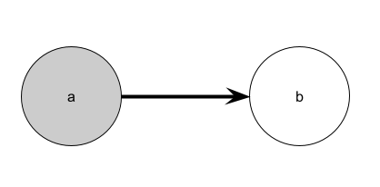

# Ejercicio 1

Sea $\gamma$ una formula proposicional del lenguaje $\{\neg,\implica\}$ tal que ninguna de  sus variables proposicionales aparece mas de una vez.  Demostrar que $\gamma$ es una contingencia.

Decimos que una fórmula $\varphi$ es una contingencia cuando existen $v$, $v'$ tal que:
$$v \models \varphi \ y \ v' \not\models \varphi$$

Veamos por inducción estructural:  
**CASO BASE** ($\varphi=p$ es un símbolo proposicional): Es una contingencia, simplemente tomamos una valuación $v_1(p) = 1$ y luego tomamos otra $v_2(p) = 0$. Entonces $v_1 \models \varphi$ y $v_2 \not\models \varphi$.

**PASO INDUCTIVO**: 

- Forma $\neg\varphi$ (por HI $\varphi$ es una contingencia):  
Como $\varphi$ es una contingencia entonces existen $v$ y $v'$ tal que
$$v \models \varphi\ y \ v' \not\models \varphi$$ 
Entonces:
$$v \not\models \neg\varphi\ y \ v' \models \neg\varphi$$ 
Entonces $\neg\varphi$ es una contingencia.
  
- Forma $\varphi \implica \psi$ (por HI $\varphi$ y $\psi$ son contingencias): 
Como ambas son contingencias, entonces existen $v_1,v'_1,v_2,v'_2$ tal que:
$$v_1 \models \varphi\ y \ v'_1 \not\models \varphi$$ 
$$v_2 \models \psi\ y \ v'_2 \not\models \psi$$ 
Luego:
$$v_2 \models \psi \underset{\text{por def}}{\entonces} v_2 \models (\varphi \implica \psi)$$
Definimos:
$$v_s(p) = \begin{cases}
v_1(p) & si\ p \in VAR(\varphi)\\
v_2'(p) & cc\\
\end{cases}$$
Esto lo podemos hacer porque $VAR(\varphi) \interseccion VAR(\psi) = \empty$ (porque ninguna de sus variables proposicionales aparece más de una vez).
Como:
$$v_s \models \varphi\ y\ v_s \not\models \psi$$
$$\underset{\text{por def}}{\entonces} v_s \not\models (\varphi \implica \psi)$$
Entonces $(\varphi \implica \psi)$ es una contingencia.

Entonces $\gamma$ es una contingencia.

# Ejercicio 2
El conjunto de los naturales que tienen resto 2 al dividirlos por 3 es el conjunto:
$$\llaves{2,5,8,...} = \llaves{2+3 \cdot x:x\in\N}$$
Veamos como expresarlo con el lenguaje $\m{L}$.  
Definimos:
$$\varphi(x): \exist y(x = 2 + y \y \exist z(z+z+z=y))$$
Cumple que $\varphi(x)$ es verdadero sii $x$ resto 3 es 2.  
Entonces la nueva relación se puede expresar como:

$$R = \llaves{v(x):U \models \varphi[v]}$$

# Ejercicio 3

Queremos ver que $SQB$ correcto con respecto a $\m{M}$, es decir:
$$SQB \vdash \varphi \entonces \m{M} \models \varphi$$
para toda $\m{L}$-sentencia $\varphi$.  
Notemos que:
$$\m{M} \models SQB$$
Entonces, sea $\varphi$ tal que:
$$SQB \vdash \varphi$$
Entonces también por correctitud:
$$SQB \models \varphi$$
Entonces:
$$SQB \models \varphi\ y\ \m{M} \models SQB \entonces \m{M} \models \varphi$$

\
Ahora veamos que no es completo con respecto a $\m{M}$, es decir:
$$\m{M} \models \varphi \entonces SQB \not\vdash \varphi$$
para alguna $\m{L}$-sentencia.  
Definimos:
$$\varphi: \forall xy(E(x,y) \implica \exist z(E(y,z)))$$
Que quiere decir: "si te llega algún arco, entonces tenés que tener un arco saliente".  
Notamos que $\m{M} \models \varphi$.

Veamos por el absurdo que $SQB \not\vdash \varphi$:
Suponemos que si. Entonces $SQB \models \varphi$ (por correctitud). Entonces cualquier estructura que satisface $SQB$ también satisface $\varphi$.  
Definimos el modelo $\m{B}$ como:  

- $B = \llaves{a,b}$  
  
- $G_{\m{B}} = \llaves{a}$  
  
- $B_{\m{B}} = \llaves{b}$  
  
- $E = \llaves{(a,b)}$

{ width=50% }

Notamos que este modelo $\m{B} \models SQB$ pero $\m{B} \not\models \varphi$. Absurdo, de suponer que $SQB \vdash \varphi$.  
Entonces $SQB \not\vdash \varphi$. Entonces $SQB$ no es completo con respecto a $\m{M}$.